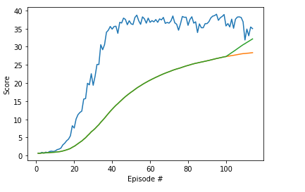

# Project 2: Continuous Control

### Introduction

For this project, I have worked with the [Reacher](https://github.com/Unity-Technologies/ml-agents/blob/master/docs/Learning-Environment-Examples.md#reacher) environment.

To be able to solve the environment, I have implemented DDPG based agent using the code provided in the lessons.  Interaction with the training environment is changed from gym to Unity. Following is the result of the training after 114 episodes. Agent was able to reach avarege score of 32. Blues line shows the score achived by the agent, orange is the overall average score and the green line is the avarage of last 100 episodes.

Video of the agent playing the game can be found [here](./demo3.wmv)

The report of the project is available in [here](./report.pdf) 